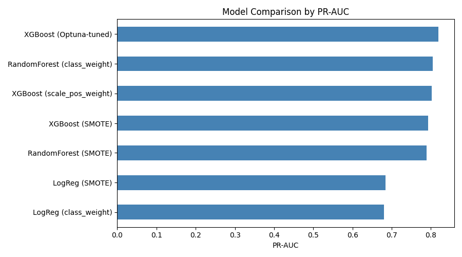
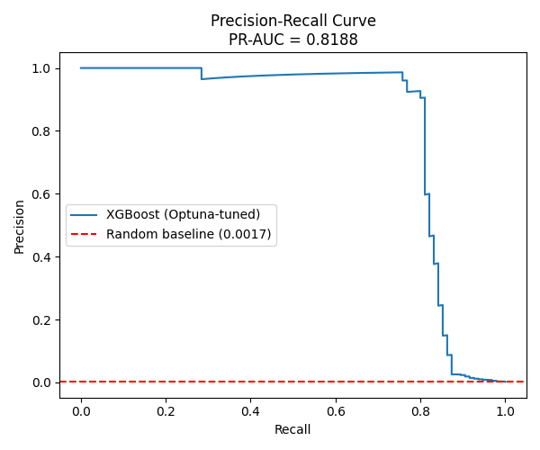
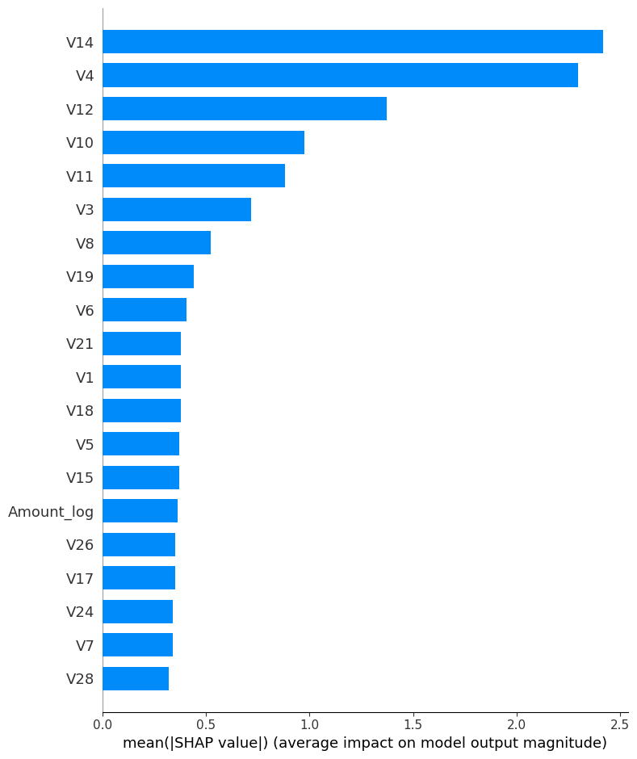

# 💳 Credit Card Fraud Detection

[](https://github.com/naveentheog/Credit-card-fraud-detection/actions)
[](https://credit-card-fraud-detection-production-dc40.up.railway.app/docs)
[](LICENSE)

**🔗 Live demo:** [/docs](https://credit-card-fraud-detection-production-dc40.up.railway.app/docs) &nbsp;|&nbsp; 284,807 real transactions &nbsp;|&nbsp; 0.17% fraud rate

---

## 1. Model Comparison

7 model/imbalance-strategy combinations, trained and evaluated on the same held-out test set.



| Model | PR-AUC | Precision | Recall |
|---|---|---|---|
| **XGBoost (Optuna-tuned)** | **0.826** | 0.915 | 0.789 |
| Random Forest (class weight) | 0.805 | 0.888 | 0.747 |
| XGBoost (untuned) | 0.803 | 0.661 | 0.800 |
| XGBoost (SMOTE) | 0.793 | 0.290 | 0.821 |
| Random Forest (SMOTE) | 0.790 | 0.574 | 0.821 |
| Logistic Regression (SMOTE) | 0.685 | 0.053 | 0.874 |
| Logistic Regression (class weight) | 0.681 | 0.055 | 0.874 |

*(PR-AUC, not accuracy — at 0.17% fraud, accuracy is meaningless.)*

## 2. Why XGBoost Wins



- **Highest PR-AUC** of all 7 combinations — best overall separation of fraud vs. legitimate
- **Best precision** (0.915) — fewest false alarms among the strong performers
- **Beats bagging (Random Forest)** — boosting corrects errors sequentially; bagging just averages
- **`scale_pos_weight` beat SMOTE** — for both XGBoost and Random Forest, real-vs-synthetic data won
- **Optuna tuning genuinely helped** — 0.803 → 0.826 PR-AUC (8 hyperparameters tuned)

## 3. Why: SHAP Explainability



`V14` and `V4` alone outweigh all other 26 features combined — most of the fraud signal is
concentrated in just 2-3 of the 28 anonymized PCA features.

## 4. Architecture

```
Transaction → FastAPI → Feature Engineering → XGBoost → Fraud Probability
                 │                                            │
                 ├── Prometheus /metrics          MLflow Model Registry
                 └── Docker → Railway (live)
```

## 5. Full Pipeline

```
Raw Data (DVC) → Validate → Feature Engineer → Handle Imbalance
     → Train (3 models) → Tune (Optuna) → Evaluate (PR-AUC)
     → Explain (SHAP) → Track (MLflow) → Detect Drift (Evidently)
     → Auto-Retrain → Serve (FastAPI) → Monitor (Prometheus) → Deploy (Docker/Railway)
```

## Quickstart

```bash
git clone https://github.com/naveentheog/Credit-card-fraud-detection.git
cd Credit-card-fraud-detection
pip install -r requirements.txt

# data/raw/creditcard.csv.dvc is tracked - get creditcard.csv from Kaggle,
# place at data/raw/creditcard.csv
uvicorn api.main:app --reload      # http://localhost:8000/docs
```

Or skip setup entirely — **[try the live API here](https://credit-card-fraud-detection-production-dc40.up.railway.app/docs)**.

## What's Inside

| | |
|---|---|
| 🔍 **EDA & Validation** | `notebooks/01_...ipynb` |
| 🤖 **Models + Tuning + SHAP** | `notebooks/02_...`, `notebooks/03_...` |
| 🚀 **API** | `api/main.py` — `/predict` `/batch_predict` `/health` `/metrics` |
| 📊 **Monitoring** | `monitoring/` — plots, drift reports, error analysis |
| 🔁 **Auto-retraining** | `src/retrain_pipeline.py` |
| ☁️ **Deployment** | `Dockerfile`, `deploy/` (AWS guide), live on Railway |

## License

MIT — see [LICENSE](LICENSE).
